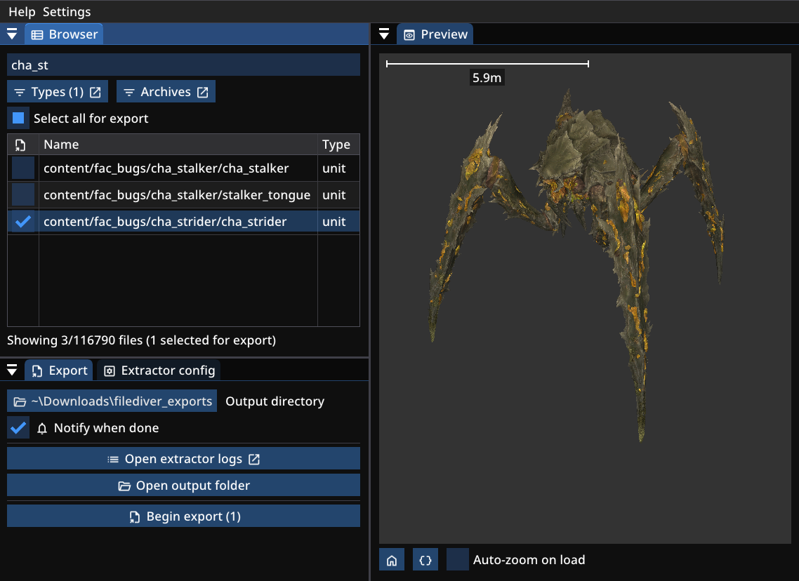

# Filediver

An unofficial Helldivers 2 game asset extractor.

## Download
### Filediver
- [Windows (64-bit)](https://github.com/xypwn/filediver/releases/latest/download/filediver-cli-windows.zip)
- [Linux (64-bit)](https://github.com/xypwn/filediver/releases/latest/download/filediver-cli-linux.zip)

**Extract the archive. This will create a folder named `filediver`, where everything relevant is located.**

The program is called "filediver.exe" (or just "filediver" on Linux). See [usage](#usage).

What is "ffmpeg.exe"?

"ffmpeg.exe" ([FFmpeg](https://ffmpeg.org/)) is used for converting video and audio files. It is downloaded from an official source by the [GitHub workflow](https://github.com/xypwn/filediver/blob/master/.github/workflows/build-release.yml) that generates the .zip archive you can download.

You only need to keep it in the folder if you don't have it installed on your computer already.

### Helper scripts (scripts_dist)
- [Windows (64-bit)](https://github.com/xypwn/filediver/releases/latest/download/scripts-dist-windows.zip)
- [Linux (64-bit)](https://github.com/xypwn/filediver/releases/latest/download/scripts-dist-linux.tar.xz)

**Extract the helper scripts achive into the `filediver` folder (the same folder containing the executable, e.g. `filediver.exe`).**

## Usage
### Windows
Navigate to the `filediver` folder (the one containing `filediver.exe`). `SHIFT`+`Right-Click` **in** the folder and select "Open in PowerShell".

In PowerShell/Terminal, run `./filediver -h` to get a list of options.

### See [Wiki](https://github.com/xypwn/filediver/wiki)
- [CLI Basics](https://github.com/xypwn/filediver/wiki/10-CLI-Basics)

## Filediver GUI (experimental)
An experimental graphical interface for Filediver, WIP.

Allows you to explore several file types using the preview,
and to interactively select your extraction options.

### Download Filediver GUI
- [Windows (64-bit)](https://github.com/xypwn/filediver/releases/latest/download/filediver-gui-windows.exe)
- [Linux (64-bit)](https://github.com/xypwn/filediver/releases/latest/download/filediver-gui-linux)

## Features
### File Types/Formats
- **Audio**: Audiokinetic wwise bnk/wem; automatically converted to WAV; other formats require FFmpeg
- **Video**: Bink; automatically converted to MP4 via FFmpeg (shipped with Windows binary)
- **Textures**: Direct Draw Surface (.dds); automatically converted to PNG
- **Models (WIP)**: Stingray Unit; automatically converted to GLB (=glTF); can be imported into [Blender](https://www.blender.org/); ability to automatically apply Thejudsub's accurate HD2 Shader; for importing bones, see [Importing Bones](#importing-bones)

Planned: animations

### Importing Bones
When importing the .glb into blender, you need to change the "Bone Dir" option from "Blender" to "Temperance", or you will see huge spheres for bones.

## Links
- [HD 2 Archive Labelling](https://docs.google.com/spreadsheets/d/1oQys_OI5DWou4GeRE3mW56j7BIi4M7KftBIPAl1ULFw) (IDs can be used with -t option)
- [Helldivers Archive Discord server](https://discord.gg/helldiversarchive)

## Credits
This app builds on a lot of work from other people. This includes:
- [Hellextractor by Xaymar](https://github.com/Xaymar/Hellextractor)
	- Basic binary file structure
	- Unhashed resource names/types (.txt files)
- [vgmstream](https://github.com/vgmstream/vgmstream), [ww2ogg by hcs](https://github.com/hcs64/ww2ogg) and [bnkextr by eXpl0it3r](https://github.com/eXpl0it3r/bnkextr)
	- Wwise audio formats
- [ImageMagick](https://imagemagick.org)
	- DDS texture decoding
- [Accurate HD2 Shader by Thejudsub](https://discord.com/channels/1210541115829260328/1222290154409033889) on [the Helldivers Archive Discord server](https://discord.gg/helldiversarchive)
	- The most accurate Blender material replicating the game's procedural shaders

Some useful discussion on the topic of HD2 resource extraction: https://reshax.com/topic/507-helldivers-2-model-extraction-help/

## Hacking
- Install [Go](https://go.dev/dl/)
- `go run ./cmd/filediver-cli`

## License
Copyright (c) filediver contributors

FileDiver is licensed under the 3-Clause BSD License (https://opensource.org/license/bsd-3-clause).
